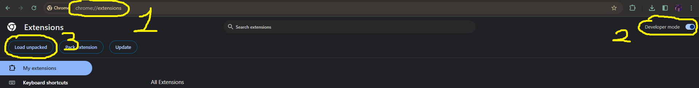
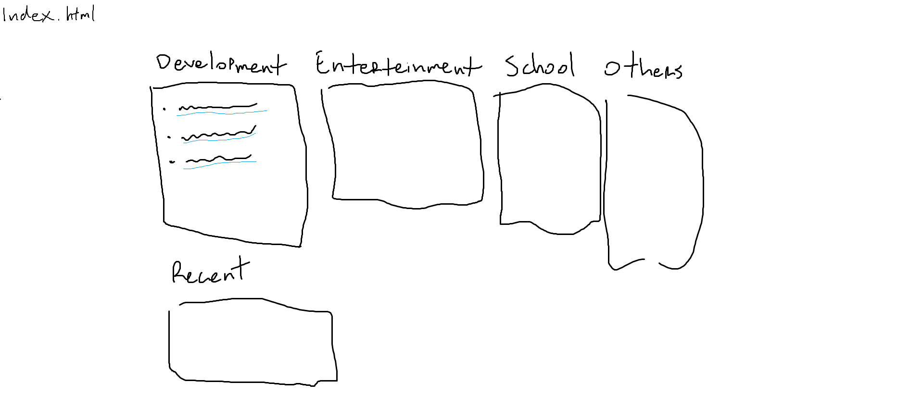
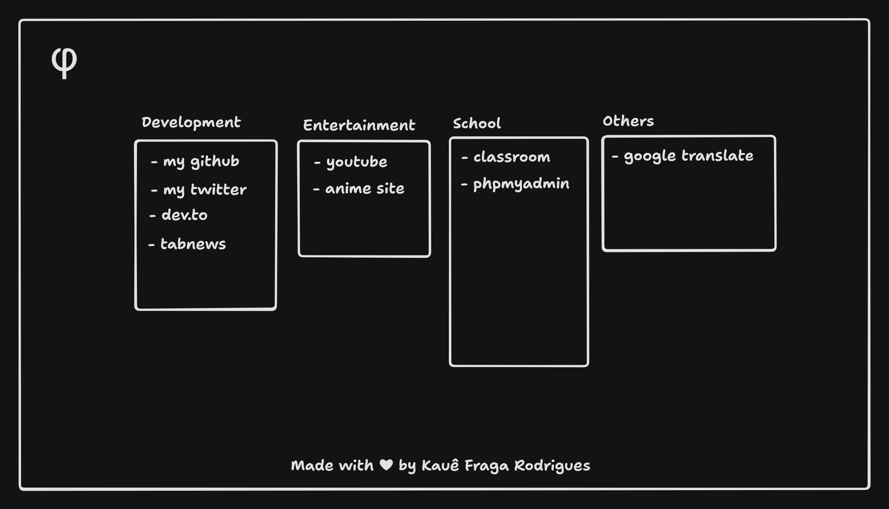
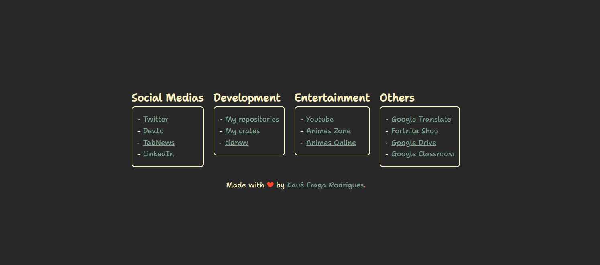

# Comfy Initial Page

> [!INFO]
> It's a "new tab" page replacement made to group some links that I use often. It is very simple and has a comfortable color palette.

> See a preview at [kauefraga.github.io/cip](https://kauefraga.github.io/cip) or go to the [gallery section](#gallery).

## ⬇ How to install it

First, go to the [CIP releases page](https://github.com/kauefraga/cip/releases) and install the latest `cip.zip`.

Or run the next commands below (curl and zip required):

```bash
curl -OL https://github.com/kauefraga/cip/releases/download/v1.0.0/cip.zip
```

Then, unzip it and go to your chromium browser extensions page (e.g. [chrome://extensions](chrome://extensions)).

```bash
unzip cip.zip
```



Turn on developer mode, click in "Load unpacked" and select the unzipped `cip` folder.

### How to modify it

> Here you will understand how to put your own links or use your own theme.

After installing, open the `index.html` in your favorite text editor.

Search for (<kbd>ctrl + f</kbd>) the links and change them. They're looking like so

```html
<h2>List label</h2>

<ul class="links">
  <li><a href="link here">Link Label</a></li>
  ...
</ul>
```

If you want to change the color scheme, open the `style.css` and change the hex colors in the `:root`.

```css
:root {
  /* Change these #hexcolor */
  --bg-color: #282828;
  --fg-color: #fbf1c7;
  --heart-color: #fb4934;
  --link-fg-color: #83a598;
  --link-fg-color-hover: #689d6a;
}
```

Feel free to fork, modify and redistribute it. It's optional, but I would love it if you gave me some credits.

## 🎨 Design Choices

First of all, I am not an UI/UX designer, so the "design choices" are just personal choices.

- Font: [Shantell Sans](https://fonts.google.com/specimen/Shantell+Sans)
- Palette: [Gruvbox](https://github.com/morhetz/gruvbox)

### Gallery

<details>
  <summary>First design, made with mspaint</summary>
  
</details>

<details>
  <summary>"Second" design, made with tldraw</summary>
  
</details>

<details>
  <summary>Latest version</summary>
  
</details>

## 📝 License

This project is licensed under the MIT License - See the [LICENSE](https://github.com/kauefraga/cip/blob/main/LICENSE) for more information.

---

Made with ❤ by Kauê Fraga Rodrigues.
